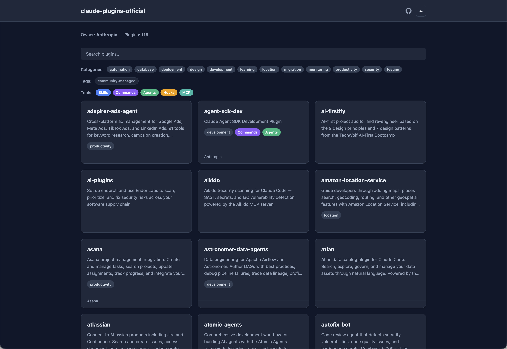

# cc-plugin-catalog

[](https://pypi.org/project/cc-plugin-catalog/)
[](https://pypi.org/project/cc-plugin-catalog/)
[](https://github.com/giginet/cc-plugin-catalog/blob/main/LICENSE)
[](https://github.com/giginet/cc-plugin-catalog/actions/workflows/ci.yml)
[](https://pypi.org/project/cc-plugin-catalog/)
[](https://github.com/giginet/cc-plugin-catalog)
[](https://github.com/giginet/cc-plugin-catalog/issues)

Static site generator for [Claude Code Plugin Marketplace](https://code.claude.com/docs/en/plugin-marketplaces) repositories.



Generate a beautiful, responsive catalog page from your marketplace's `marketplace.json` and `plugin.json` files — and deploy it to GitHub Pages with a single reusable workflow.

## Features

- **Plugin catalog pages** — Grid index page with plugin cards and individual detail pages
- **Component detection** — Automatically scans and displays Skills, Commands, Agents, Hooks, MCP Servers, and LSP Servers
- **Search & filter** — Incremental search with inline category, tag, and tool type filters
- **Markdown rendering** — README and LICENSE files rendered as HTML
- **Dark / Light mode** — Toggle with `prefers-color-scheme` detection and `localStorage` persistence
- **GitHub integration** — Auto-links to source file trees, GitHub icon in header
- **Reusable workflow** — One-line GitHub Actions setup for any marketplace repository

## Quick Start

### Preview a marketplace locally

No installation required — just use [`uvx`](https://docs.astral.sh/uv/):

```bash
uvx cc-plugin-catalog preview /path/to/marketplace-repo
```

Open http://localhost:8000/ in your browser. Press `Ctrl+C` to stop.

```bash
# Custom port and output directory
uvx cc-plugin-catalog preview /path/to/marketplace-repo -p 3000 -o _site
```

### Build static files

```bash
uvx cc-plugin-catalog build /path/to/marketplace-repo -o _site
```

This generates a fully static site in `_site/` that can be deployed anywhere.

## Deploy to GitHub Pages

Add a single workflow file to your marketplace repository to automatically build and deploy the catalog site on every push.

### 1. Enable GitHub Pages

Go to your marketplace repository's **Settings > Pages** and set the source to **GitHub Actions**.

### 2. Add the workflow

Create `.github/workflows/deploy-catalog.yml`:

```yaml
name: Deploy Plugin Catalog

on:
  push:
    branches: [main]

permissions:
  pages: write
  id-token: write

jobs:
  deploy:
    uses: giginet/cc-plugin-catalog/.github/workflows/build-pages.yml@main
```

That's it! Every push to `main` will build your catalog and deploy it to GitHub Pages.

### Workflow inputs

| Input | Default | Description |
|-------|---------|-------------|
| `catalog-version` | `""` (latest) | `cc-plugin-catalog` version to install |
| `output-dir` | `"_site"` | Output directory for generated files |

```yaml
jobs:
  deploy:
    uses: giginet/cc-plugin-catalog/.github/workflows/build-pages.yml@main
    with:
      catalog-version: "0.0.1"
      output-dir: "dist"
```

## CLI Reference

```
Usage: cc-plugin-catalog [OPTIONS] COMMAND [ARGS]...

Commands:
  build    Build a static site from a Plugin Marketplace repository.
  preview  Build and serve the site locally with live preview.
```

### `build`

```bash
cc-plugin-catalog build <REPO_PATH> [-o OUTPUT]
```

| Option | Default | Description |
|--------|---------|-------------|
| `-o`, `--output` | `_site` | Output directory |

### `preview`

```bash
cc-plugin-catalog preview <REPO_PATH> [-o OUTPUT] [-p PORT] [--host HOST]
```

| Option | Default | Description |
|--------|---------|-------------|
| `-o`, `--output` | `_site` | Output directory |
| `-p`, `--port` | `8000` | Port to serve on |
| `--host` | `localhost` | Host to bind to |

## Supported Plugin Components

cc-plugin-catalog detects and displays the following component types from plugin directories:

| Component | Source | Detected From |
|-----------|--------|---------------|
| **Skills** | `skills/*/SKILL.md` | Folder name, YAML frontmatter |
| **Commands** | `commands/*.md` | Filename, YAML frontmatter |
| **Agents** | `agents/*.md` | YAML frontmatter (name, description, model) |
| **Hooks** | `hooks/hooks.json` | Event names, matchers |
| **MCP Servers** | `.mcp.json` | Server names, commands |
| **LSP Servers** | `.lsp.json` | Language names, commands |

## Development

```bash
git clone https://github.com/giginet/cc-plugin-catalog.git
cd cc-plugin-catalog
uv sync --dev
```

### Run tests

```bash
uv run pytest tests/ -v
```

### Lint & format

```bash
uv run ruff check src/ tests/
uv run ruff format src/ tests/
```

### Type check

```bash
uv run ty check src/
```
