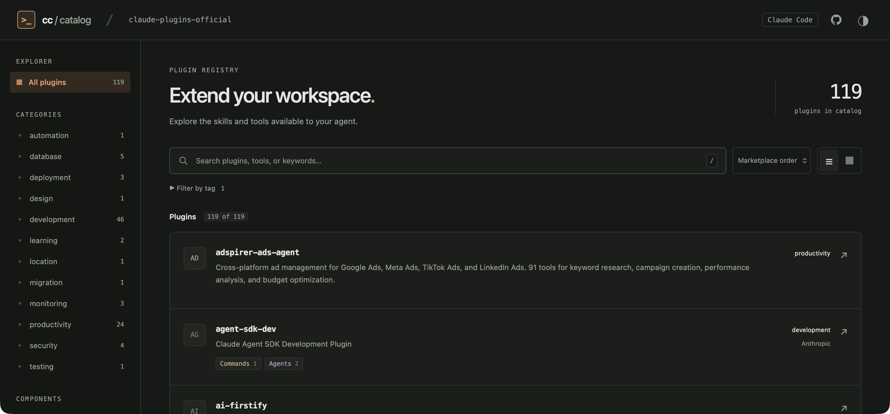

# agent-plugin-catalog

[](https://pypi.org/project/agent-plugin-catalog/)
[](https://pypi.org/project/agent-plugin-catalog/)
[](https://github.com/giginet/agent-plugin-catalog/blob/main/LICENSE)
[](https://github.com/giginet/agent-plugin-catalog/actions/workflows/ci.yml)
[](https://pypi.org/project/agent-plugin-catalog/)
[](https://github.com/giginet/agent-plugin-catalog)
[](https://github.com/giginet/agent-plugin-catalog/issues)

Static site generator for [Claude Code Plugin Marketplace](https://code.claude.com/docs/en/plugin-marketplaces) and [Codex Plugin Marketplace](https://developers.openai.com/plugins/build/plugins) repositories.

Formerly `cc-plugin-catalog`. The package, CLI, and Python module are now named `agent-plugin-catalog`, `agent-plugin-catalog`, and `agent_plugin_catalog` respectively. Update installation commands, imports, and reusable workflow references when migrating.



Generate a beautiful, responsive catalog page from your marketplace's `marketplace.json` and `plugin.json` files — and deploy it to GitHub Pages with a single reusable workflow.

**Demo:** [https://giginet.me/claude-plugins-official/](https://giginet.me/claude-plugins-official/index.html)

## Features

- **Plugin catalog pages** — Grid index page with plugin cards and individual detail pages
- **Claude Code & Codex** — Auto-detects marketplace format and shows the appropriate installation instructions
- **Component detection** — Automatically scans and displays Skills, Commands, Agents, Hooks, MCP Servers, LSP Servers, and Apps
- **Search & filter** — Incremental search with inline category, tag, and tool type filters
- **Markdown rendering** — README and LICENSE files rendered as HTML
- **Dark / Light mode** — Toggle with `prefers-color-scheme` detection and `localStorage` persistence
- **GitHub integration** — Auto-links to source file trees, GitHub icon in header
- **Reusable workflow** — One-line GitHub Actions setup for any marketplace repository

## Quick Start

### Preview a marketplace locally

No installation required — just use [`uvx`](https://docs.astral.sh/uv/):

```bash
uvx agent-plugin-catalog preview /path/to/marketplace-repo
```

Open http://localhost:8000/ in your browser. Press `Ctrl+C` to stop.

```bash
# Custom port and output directory
uvx agent-plugin-catalog preview /path/to/marketplace-repo -p 3000 -o _site
```

### Build static files

```bash
uvx agent-plugin-catalog build /path/to/marketplace-repo -o _site
```

This generates a fully static site in `_site/` that can be deployed anywhere.

## Supported marketplace formats

| Format | Marketplace manifest | Plugin manifest |
|--------|----------------------|-----------------|
| Claude Code | `.claude-plugin/marketplace.json` | `.claude-plugin/plugin.json` |
| Codex | `.agents/plugins/marketplace.json` | `plugin.json`, `.codex-plugin/plugin.json`, or `.claude-plugin/plugin.json` |

Auto-detection prefers the Codex marketplace when both files exist. To choose explicitly, use `--marketplace-format claude` or `--marketplace-format codex` with either `build` or `preview`:

```bash
uvx agent-plugin-catalog build /path/to/marketplace-repo --marketplace-format codex -o _site
```

Codex marketplaces may omit `owner` and use `interface.displayName` for their title. Local sources can use `{"source": "local", "path": "./plugins/my-plugin"}` or a plain `"./plugins/my-plugin"` path, relative to the repository root. External sources are listed using marketplace metadata; their repositories are not downloaded.

For Codex plugins, the catalog uses `interface.displayName` and presentation metadata while keeping plugin identifiers in URLs. It reads declared Skills, MCP, and Apps paths in addition to conventional directories. Portable root `plugin.json` manifests use `skills/` and `mcp.json`, with OpenAI presentation settings from `extensions.com.openai` or the compatibility overlay.

Codex detail pages show `codex plugin marketplace add` and direct users to select the plugin in the app. Entries marked `NOT_AVAILABLE` show an availability message instead of installation instructions.

## Deploy to GitHub Pages

Add a single workflow file to your marketplace repository to automatically build and deploy the catalog site on every push.

### 1. Enable GitHub Pages

Go to your marketplace repository's **Settings > Pages** and set the source to **GitHub Actions**.

### 2. Add the workflow

Create `.github/workflows/deploy-catalog.yml`:

```yaml
name: Deploy Plugin Catalog

on:
  push:
    branches: [main]

permissions:
  pages: write
  id-token: write

jobs:
  deploy:
    uses: giginet/agent-plugin-catalog/.github/workflows/build-pages.yml@v1
    # Optional: customize with inputs
    # with:
    #   base-url: "https://example.github.io/my-marketplace"  # Enables OGP meta tags
    #   logo: "assets/logo.png"                                # Header logo image
```

That's it! Every push to `main` will build your catalog and deploy it to GitHub Pages.

### Workflow inputs

All inputs are optional.

| Input | Default | Description |
|-------|---------|-------------|
| `catalog-ref` | `""` | Install `agent-plugin-catalog` from a git ref (branch, tag, or SHA) instead of PyPI |
| `output-dir` | `"_site"` | Output directory for generated files |
| `base-url` | `""` | Base URL for OGP meta tags. OGP tags are only generated when this is set. |
| `logo` | `""` | Path to a logo image in the repository (e.g. `assets/logo.png`) |
| `marketplace-repository` | `""` | Marketplace repo identifier for install commands. `owner/repo` for GitHub.com, full URL for GitHub Enterprise (e.g. `https://my-git-server.com/owner/repo`). Auto-detected from git remote if not set. |
| `marketplace-format` | `"auto"` | Select `auto`, `claude`, or `codex`. Auto-detection prefers Codex when both manifests exist. |

```yaml
# Example with optional inputs
jobs:
  deploy:
    uses: giginet/agent-plugin-catalog/.github/workflows/build-pages.yml@v1
    with:
      base-url: "https://example.github.io/my-marketplace"
      logo: "assets/logo.png"
```

The `logo` path is relative to the repository root. Simply commit an image file (PNG, SVG, etc.) to your repository and reference it.

### Without the reusable workflow

If you can't use the reusable workflow (e.g. GitHub Enterprise, custom runners, or additional build steps):

```yaml
name: Deploy Plugin Catalog

on:
  push:
    branches: [main]

permissions:
  pages: write
  id-token: write

jobs:
  build-and-deploy:
    runs-on: ubuntu-latest
    environment:
      name: github-pages
      url: ${{ steps.deployment.outputs.page_url }}
    steps:
      - uses: actions/checkout@v4
      - uses: astral-sh/setup-uv@v5
      - run: uv tool install agent-plugin-catalog
      - run: agent-plugin-catalog build . -o _site --base-url "https://example.github.io/my-marketplace" --logo assets/logo.png --marketplace-repository "https://my-git-server.com/owner/my-marketplace"
      - uses: actions/upload-pages-artifact@v3
        with:
          path: _site
      - id: deployment
        uses: actions/deploy-pages@v4
```

> [!NOTE]
> `--marketplace-repository` is used to generate install commands on each plugin page. Accepts `owner/repo` for GitHub.com. For GitHub Enterprise or other hosts, specify the full URL (e.g. `https://my-git-server.com/owner/my-marketplace`). When set, this value takes priority over the auto-detected git remote. It is recommended to explicitly set this option for GitHub Enterprise environments.

## Supported Plugin Components

agent-plugin-catalog detects and displays the following component types from plugin directories:

| Component | Source | Detected From |
|-----------|--------|---------------|
| **Skills** | `skills/*/SKILL.md` | Folder name, YAML frontmatter |
| **Commands** | `commands/*.md` | Filename, YAML frontmatter |
| **Agents** | `agents/*.md` | YAML frontmatter (name, description, model) |
| **Hooks** | `hooks/hooks.json` | Event names, matchers |
| **MCP Servers** | `.mcp.json` | Server names, commands |
| **LSP Servers** | `.lsp.json` | Language names, commands |
| **Apps** | `.app.json` or manifest-declared path | Integration names and IDs |

Codex MCP definitions may also be inline in the manifest or use a custom file path. HTTP server URLs are displayed alongside command-based servers.

## Development

```bash
git clone https://github.com/giginet/agent-plugin-catalog.git
cd agent-plugin-catalog
uv sync --dev
```

### Run tests

```bash
uv run pytest tests/ -v
```

### Lint & format

```bash
uv run ruff check src/ tests/
uv run ruff format src/ tests/
```

### Type check

```bash
uv run ty check src/
```
